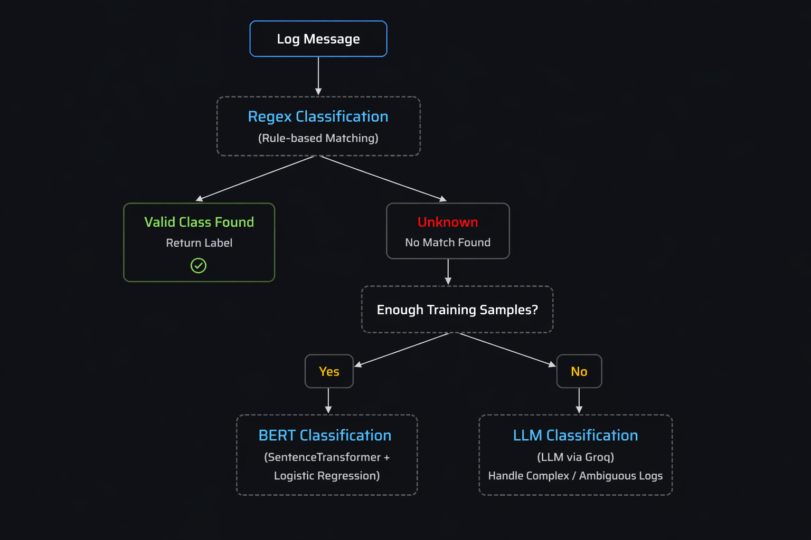

# Scalable Hybrid Log Classification Framework

## Overview

This project implements a scalable hybrid log classification system that processes high-volume, unstructured log data using a combination of rule-based methods, machine learning, and large language models.

The framework is designed for real-world environments such as retail operations, supply chain systems, and enterprise platforms, where logs originate from multiple heterogeneous sources.

---

## Problem

Operational systems generate large volumes of logs that are:

- Unstructured and inconsistent across sources  
- Difficult to categorize using a single approach  
- Critical for monitoring, debugging, and analytics  

---

## Solution

The system adopts a hybrid classification strategy:

1. **Regular Expression (Regex)**  
   Handles predictable and repetitive log patterns with minimal latency and cost  

2. **Sentence Transformer + Logistic Regression**  
   Handles semantically similar and moderately complex logs using embeddings and supervised learning  

3. **LLM (Large Language Model)**  
   Handles ambiguous, complex, or low-data scenarios and acts as a fallback layer  

Logs are dynamically routed to the most appropriate classifier based on source and confidence.

---


## Architecture



---

## Folder Explanation


- **server.py**
  FastAPI server that accepts the file and sends to the hybrid classification framework

- **processor_regex.py**  
  Contains rule-based classification using predefined regex patterns. Fastest layer for known logs.

- **processor_bert.py**  
  Handles embedding generation using Sentence Transformers and performs classification using a trained ML model.

- **processor_llm.py**  
  Uses a Large Language Model (via API) to classify complex or ambiguous logs.

- **models/**  
  Stores trained machine learning models used for inference (e.g., Logistic Regression classifier).

- **resources/**  
  Contains input datasets, output files, and architecture diagrams.

- **requirements.txt**  
  Lists all required dependencies for running the project.

---


## Setup and Run

```bash
cd <your-project-folder>

python -m venv venv

source venv/bin/activate        # Mac/Linux
# venv\Scripts\activate         # Windows

pip install -r requirements.txt

export GROQ_API_KEY=your_api_key_here   # Mac/Linux

# set GROQ_API_KEY=your_api_key_here    # Windows

uvicorn server:app --reload